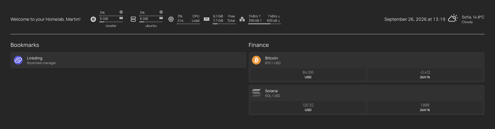

# Lab (k3s + Tailscale)

Private homelab on Tailscale. Apps are exposed via Traefik Ingress on `*.lab.dobreff.net`.



| Host | App |
|---|---|
| `https://lab.dobreff.net` | Homepage |
| `https://linkding.lab.dobreff.net` | Linkding |
| `https://car.lab.dobreff.net` | Car App |

## Layout

```
lab/
  homepage/     # dashboard
  linkding/     # bookmarks
  car-app/      # vehicle maintenance tracker
  tls/          # wildcard cert via Let's Encrypt DNS-01 (Netlify)
```

## DNS (Netlify)

| Type | Name | Value |
|---|---|---|
| A | `lab` | Tailscale IP (`100.x…`) |
| A | `*.lab` | same |

(`car.lab` is covered by `*.lab`.)

## TLS

```bash
export NETLIFY_TOKEN='...'
export ACME_EMAIL='you@dobreff.net'
./tls/issue-cert.sh
```

Writes Secret `lab-dobreff-net-tls` into `homepage`, `linkding`, and `car-app` (TLS Secrets are namespaced).

## Apply

```bash
# Homepage
kubectl apply -f homepage/namespace.yaml
kubectl apply -f homepage/

# Linkding
kubectl apply -f linkding/namespace.yaml
kubectl apply -f linkding/

# Car App (see car-app/README.md for secrets + seed)
kubectl apply -f car-app/namespace.yaml
kubectl apply -f car-app/

# After ConfigMap changes, restart Homepage (subPath mounts do not hot-reload)
kubectl rollout restart deploy/homepage -n homepage
```

## Notes

- One hostname per app (subdomain under `lab.dobreff.net`). Do not list the same app in both Homepage `services.yaml` and Ingress `gethomepage.dev/*` annotations.
- Pin image tags in production instead of `:latest`.
- Kubernetes CPU/mem widgets need metrics-server.
